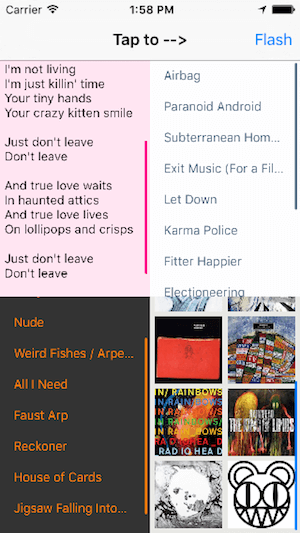
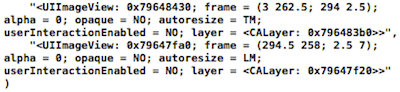

# ASJColoredScrollIndicators

The stock `UIScrollView` provides limited options to customize its scroll indicators, with a sole enum `UIScrollViewIndicatorStyle` that may prove lacking. It makes sense sometimes to paint the indicators as per the app's theme to give it a little extra. This small utility provides a `UIScrollView` category with a lightweight solution to apply a color to the scroll indicators.

After coming across [JTSScrollIndicator](https://github.com/jaredsinclair/JTSScrollIndicator) and looking at its implementation, I felt there could be an easier way to do this. My implementation gets a hold of the scroll indicator objects themselves and paints them to the desired color. I feel this is a much more simple and direct approach.



# Installation

CocoaPods is the preferred way to install this library. Add this command to your `Podfile`:

```ruby
pod 'ASJColoredScrollIndicators'
```

# Usage

Import `ASJColoredScrollIndicators.h` and set this property to any `UIScrollView`:

```objc
@property (nullable, strong, nonatomic) UIColor *scrollIndicatorColor UI_APPEARANCE_SELECTOR;
```

Paints both the horizontal and vertical scroll indicators to the desired color.

You may also set the property via `UIAppearance` to set the color globally:

```objc
[UIScrollView appearance].scrollIndicatorColor = [UIColor blueColor];
```

Since this is a category on `UIScrollView`, it works with all subclasses:
- `UITableView`
- `UICollectionView`
- `UITextView`

# How it works

`UIScrollView`'s scroll indicators are not publicly available. Looking at its subviews, we find two `UIImageView`s that appear to be the indicators. Each has either their width or height 2.5 pts. Interestingly, no matter whether your view scrolls in both directions, the vertical and horizontal indicator objects are present.



So it would seem that modifying these `UIImageView`s would do the job. But no! What I found is that these objects are changed when the scrolling is active; their memory addresses were different. This happens every time. You could check the indicators in `scrollViewDidScroll:` or `scrollViewWillBeginDragging`, the addresses there are the same, but not the same when the `UIScrollView` initially loaded.

When this was clear, the rest was pretty simple. I tried to change the background color of those `UIImageView`s but the effect was not nice; there still was some transparency. I ended up removing the image's color information and setting a background color to the `UIImageView` with some rounding to shape it look like a default indicator. Voilà!

This color change is done exactly once, when the `UIScrollView` is about to be scrolled for the very first time.

Note: Since iOS 13, the indicators are no longer `UIImageView`s but a private subclass of `UIView` called `_UIScrollViewScrollIndicator`.

# Credits

- To [Shashank Pali](https://github.com/shashankpali) for his perseverence to unite this functionality under a single category.

# To-do

- ~~Add `UICollectionView` and `UITextView`.~~
- ~~Find a way to combine the four in one class.~~

# License

`ASJColoredScrollIndicators` is available under the MIT license. See the LICENSE file for more info.
