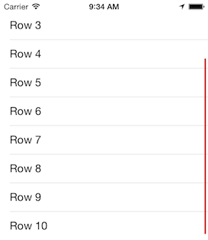

# ASJColoredScrollIndicators

The stock `UIScrollView` provides limited options to customize its scroll indicators, with a sole enum `UIScrollViewIndicatorStyle` that may prove lacking. It makes sense sometimes to paint the indicators as per the app's theme to give it a little extra. This small utility provides a `UIScrollView` category with a lightweight solution to apply a color to the scroll indicators.

After coming across [JTSScrollIndicator](https://github.com/jaredsinclair/JTSScrollIndicator) and looking at its implementation, I felt there could be an easier way to do this. My implementation gets a hold of the scroll indicator objects themselves and paints them to the desired color. I feel this is a much more simple and direct approach.



# Installation

CocoaPods is the preferred way to install this library. Add this command to your `Podfile`:

```
pod 'ASJColoredScrollIndicators'
```

# Usage

Import `ASJColoredScrollIndicators.h` and set this property to any `UIScrollView`:

```objc
@property (nullable, strong, nonatomic) UIColor *scrollIndicatorColor UI_APPEARANCE_SELECTOR;
```
Paints both the horizontal and vertical scroll indicators to the desired color.

You may also set the property via `UIAppearance` to set the color globally:

```objc
[UIScrollView appearance].scrollIndicatorColor = [UIColor blueColor];
```

Since this is a category on `UIScrollView`, it works with all subclasses:
- `UITableView`
- `UICollectionView`
- `UITextView`

# Credits

- To [Shashank Pali](https://github.com/shashankpali) for his perseverence to unite this functionality under a single category

# To-do

- ~~Add `UICollectionView` and `UITextView`~~
- ~~Find a way to combine the four in one class~~

# License

`ASJColoredScrollIndicators` is available under the MIT license. See the LICENSE file for more info.
